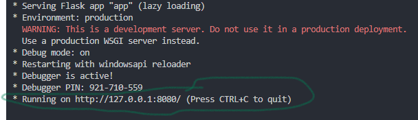
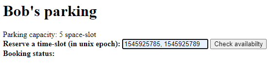

# Parking Lot System

# Introduction
The purpose of this development is the creation of a simple reservation app for booking space-slots for your car.
This document gives instructions on how to use it.

# Test the app
- Create an environment in Python and install the dependencies (pip install -r requirements.txt)
- Run the app.py file
- From the pop-up terminal, press CTRL+click on the http undress -> 
- Place your time-slot in unix_epoch and press Check availability -> 
    Tip! Various test data in epoch units can be found in the doc/test_time_slots.txt file
- Alternatively, the full functionality of the development can be tested by running the main.py file (it includes test cases with comments)

## Design principles
Open-source tools were used for this development such as Python. The design principle of the development was the balance between simplicity, feature functionality, and robustness.

## Technical specifications
- Programming language -> Python
- Dependencies/packages -> datetime, numpy, warnings, typing, flask, pytest
- Required prior knowledge -> Basic knowledge of Python and software development
- Functionality test -> The functionality has been checked by implementing unit tests

# Future improvements
## Functionality/efficiency:
- Use user-friendly timestamp as input for every reservation (format dd-mm-yyyy HH:MM:SS e.g. (2022-07-03 15:00:00, 2022-08-03 11:00:00)) instead of unix epoch.
- Raise error, when invalid input is inserted (e.g. negative time-slots, start date > end date, etc)
- Warn the user, if the reservation epoch does not make sense (e.g. request reservation for the past or the far away future)
- Make use of the "clear_expired_time_slots" method every time a new reservation is requested.
- In general, the developed interface should have illustrated the available time-slots of all the space-slots of the parking, to give the user a first idea of the availability of the parking.
- Further development of the app should be done with more features avaliable to the user (e.g. cancel a reservation, change a reservation, etc).
